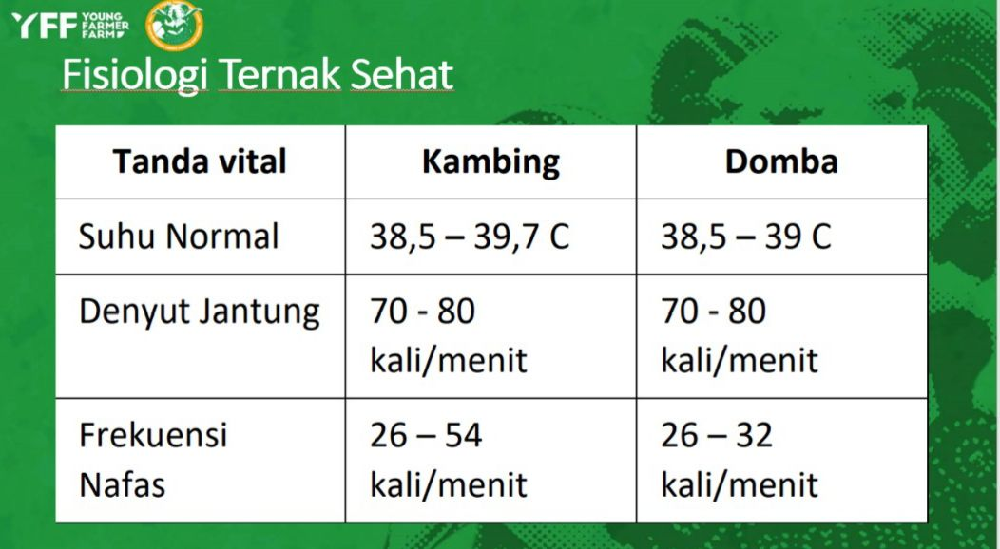

# Prediction Health Farm Based on Internet of Things with MQTT and Firebase

Prediction for Got

<ul>
    <li>Breath: 26 - 54 x/minute</li>
    <li>Heart Rate: 70 - 80 x/minute</li>
    <li>Temperature: 38,5 - 39,7 C</li>
</ul>

Prediction for Sheep

<ul>
    <li>Breath: 26 - 32 x/minute</li>
    <li>Heart Rate: 70 - 80 x/minute</li>
    <li>Temperature: 38,5 - 39 C</li>
</ul>

Calibration Sensor

<ul>
  <li>Breath Sensor: <a href="https://github.com/Muhammad-Ikhwan-Fathulloh/Proyek-Farm-Prediction-Goat-and-Sheep/tree/main/BreathSensor">View</a></li>
  <li>Heart Rate Sensor: <a href="https://github.com/Muhammad-Ikhwan-Fathulloh/Proyek-Farm-Prediction-Goat-and-Sheep/tree/main/HeartRateSensor">View</a></li>
  <li>Temperature Sensor: <a href="https://github.com/Muhammad-Ikhwan-Fathulloh/Proyek-Farm-Prediction-Goat-and-Sheep/tree/main/TemperatureSensor">View</a></li>
</ul>

Full Code

<ul>
  <li>CodeMQTT: <a href="https://github.com/Muhammad-Ikhwan-Fathulloh/Proyek-Farm-Prediction-Goat-and-Sheep/tree/main/CodeMQTT">View</a></li>
  <li>CodePrediction: <a href="https://github.com/Muhammad-Ikhwan-Fathulloh/Proyek-Farm-Prediction-Goat-and-Sheep/tree/main/CodePrediction">View</a></li>
  <li>FullCode: <a href="https://github.com/Muhammad-Ikhwan-Fathulloh/Proyek-Farm-Prediction-Goat-and-Sheep/tree/main/FullCode/FullCode.ino">View</a></li>
  <li>FullCodePrediction: <a href="https://github.com/Muhammad-Ikhwan-Fathulloh/Proyek-Farm-Prediction-Goat-and-Sheep/tree/main/FullCode/FullCodePrediction.ino">View</a></li>
</ul>
